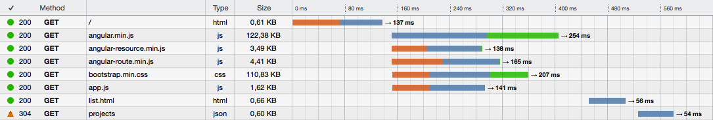

# connect-mongodb-session-cached

[connect-mongodb-session](https://www.npmjs.com/package/connect-mongodb-session) plus a short living cache to reduce database calls

---

**Only use this library if your load balancer supports sticky sessions.** Ask your hosting provider if the load balancer always forwards all requests from one IP address to the same node.js instance.

---

[](https://travis-ci.org/analog-nico/connect-mongodb-session-cached) [](https://coveralls.io/github/analog-nico/connect-mongodb-session-cached?branch=master) [](https://david-dm.org/analog-nico/connect-mongodb-session-cached)

## Installation

[](https://npmjs.org/package/connect-mongodb-session-cached)

This is a module for node.js and is installed via npm:

``` bash
npm install connect-mongodb-session-cached --save
```

## Usage

This is a **drop-in replacement for [connect-mongodb-session](https://www.npmjs.com/package/connect-mongodb-session)**. Please read the docs of this package.

connect-mongodb-session-cached adds **one additional parameter** to the options:

``` js
var store = new MongoDBStore({
    uri: 'mongodb://localhost:27017/connect_mongodb_session_test',
    collection: 'mySessions',
    expireCacheAfter: 10000 // <-- This is the additional parameter with its default value.
});
```

connect-mongodb-session-cached uses the [two-buckets-memcache](https://www.npmjs.com/package/two-buckets-memcache) to cache loaded sessions in order to reduce database calls. The `expireCacheAfter` value is forwarded to the two-buckets-memcache. Thus cached sessions expire i.e. in 10 to 20 seconds after they were loaded from the database.

Assume your app serves the following page to the browser which is tied to a session:



Like in most cases the page load includes the main html page, some js and css files, html templates, and data. Usually for all of those requests the server loads the session object from the database. If your load balancer forwards all of these requests to the same node instance the database calls can be easily reduced with the short living cache. The cache just has to live long enough to cover the load time of a page and its associated resources.

**Only use this library if your load balancer supports sticky sessions.** Ask your hosting provider if the load balancer always forwards all requests from one IP address to the same node.js instance.

## Contributing

To set up your development environment for Quota:

1. Clone this repo to your desktop,
2. in the shell `cd` to the main folder,
3. hit `npm install`,
4. hit `npm install gulp -g` if you haven't installed gulp globally yet, and
5. run `gulp dev`. (Or run `node ./node_modules/.bin/gulp dev` if you don't want to install gulp globally.)

`gulp dev` watches all source files and if you save some changes it will lint the code and execute all tests. The test coverage report can be viewed from `./coverage/lcov-report/index.html`.

If you want to debug a test you should use `gulp test-without-coverage` to run all tests without obscuring the code by the test coverage instrumentation.

## Change History

- v0.1.1 (2016-04-03)
    - Added node v5 to CI build
    - Updated dependencies
- v0.1.0 (2015-10-18)
    - Initial version

## License (ISC)

In case you never heard about the [ISC license](http://en.wikipedia.org/wiki/ISC_license) it is functionally equivalent to the MIT license.

See the [LICENSE file](LICENSE) for details.
